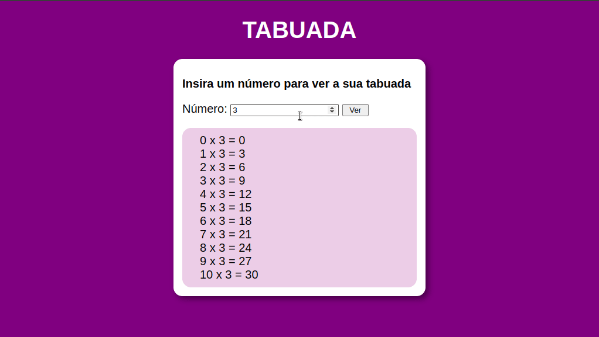

    

<h1>Projeto Tabuada</h1>

Este projeto foi desenvolvido com HTML5, CSS3 e JavaScript para estudos de manipulação do DOM, onde deve ser inserido um número no local indicado para que a tabuada do mesmo seja apresentada logo abaixo.

    

   Confira <a href="https://mendjoy.github.io/projeto-tabuada-js/">aqui</a>

 
